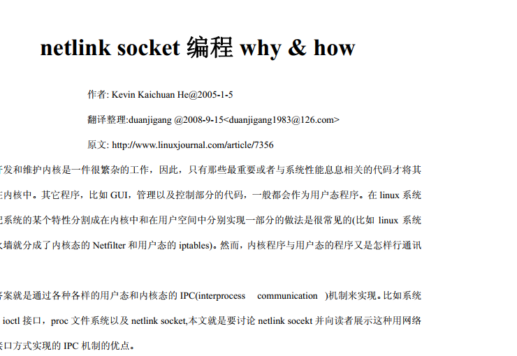

# 2018-08-13

[TOC]

## todo

- [x] understand modules
- [x] start example code of hw;
- [x] read the ref code from teacher;
- [ ] achieve the requirement by finish optodo 1


## optodo

- [x] use new code by change `struct Security_module_options` member to string(FAILED!!)

## refs:

用户空间和内核空间通讯之【Netlink 中】:

http://blog.chinaunix.net/uid-23069658-id-3405954.html


## modules 

在开始之前，还是先了解一下Linux内核模块机制吧！

　　模块（Module）机制：用户可以根据需要，在不需要对内核重新编译的情况下，可以将模块动态地载入或移出内核．

　　模块是具有独立功能的程序，它可以被单独编译，但不能独立运行，它在运行时被链接到内核，作为内核的一部分在内核空间运行．

　　模块通常由一组函数和数据结构组成，用来实现一种文件系统，一个驱动程序或其他内核上层的功能．

　　内核模块是Linux 内核向外提供的一个插口，其全称为动态可加载内核模块（Loader Kernel Module , LKM），简称为模块．

 

模块编程

　　内核模式下编程有一些限制：

　　I. 不能使用用户模式下的C标准库，因为内核模式下不存在lib库，也就没有这些用户函数供使用．

　　II. 不能使用浮点运算，因为Linux内核切换模式时不保存处理器的浮点状态．

　　III. 尽可能保持代码的清洁整齐，因为内核调试不方便，简洁的代码能减少并方便后期调试．

　　IV. 模块编程和内核版本密切关联，因为不同的内核版本中某些函数的函数名会有变化．因此模块编程也可以说是内核编程．

　　V. 只用超级用户可以对其运行


### add the module to linux kernal

`sudo insmode mynlkern.ko`


### 查看加载模块信息 only show module list

`lsmod`查看模块查看加载模块输出信息

will not show module's output, so we need follow ways: 如果日志在更新，如何实时查看

### 如果日志在更新，如何实时查看

用命令`dmesg  | tail -1`

`tail -f`

如果日志在更新，如何实时查看 `tail -f /var/log/messages`

#### know: kernal log location

kern.*              -/var/log/kern.log

还可以使用`user@ubuntu:/var/log$ watch -d -n 1 tail /var/log/kern.log`

`-d`表示高亮不同的地方，`-n`表示多少秒刷新一次。

#### ref(Ubuntu查看和写入系统日志 )

https://www.cnblogs.com/EasonJim/p/7189491.html

u can use :

`tail -n 10 /var/log/syslog`

### show u the result


## gnome-screenshot command

`cd T48DailyReport/img`

` gnome-screenshot -a -f net_link0.png`


## code from cnblog is older than one from git

and func: netlink_kernel_create() has already changed from

```
netlink_kernel_create(NETLINK_TEST,0,nl_data_ready,THIS_MODULE);
```

to

```
netlink_kernel_create(struct net *net, int unit, struct netlink_kernel_cfg *cfg)

```

### old code compile error

code from 

http://blog.chinaunix.net/uid-23069658-id-3405954.html 

is 2012, old stuff


if compile, error as follow:

```s
user@ubuntu:~/Desktop/osHomeWork/netlink_work0$ make
make -C /lib/modules/4.15.0-30-generic/build SUBDIRS=/home/user/Desktop/osHomeWork/netlink_work0 modules
make[1]: Entering directory '/usr/src/linux-headers-4.15.0-30-generic'
Makefile:976: "Cannot use CONFIG_STACK_VALIDATION=y, please install libelf-dev, libelf-devel or elfutils-libelf-devel"
  CC [M]  /home/user/Desktop/osHomeWork/netlink_work0/net_link_kern.o
/home/user/Desktop/osHomeWork/netlink_work0/net_link_kern.c:31:19: error: function declaration isn’t a prototype [-Werror=strict-prototypes]
 static int __init myinit_module()
                   ^~~~~~~~~~~~~
/home/user/Desktop/osHomeWork/netlink_work0/net_link_kern.c: In function ‘myinit_module’:
/home/user/Desktop/osHomeWork/netlink_work0/net_link_kern.c:10:22: warning: passing argument 1 of ‘netlink_kernel_create’ makes pointer from integer without a cast [-Wint-conversion]
 #define NETLINK_TEST 25
                      ^
/home/user/Desktop/osHomeWork/netlink_work0/net_link_kern.c:34:35: note: in expansion of macro ‘NETLINK_TEST’
     nl_sk = netlink_kernel_create(NETLINK_TEST,0,nl_data_ready,THIS_MODULE);
                                   ^~~~~~~~~~~~
In file included from ./include/uapi/linux/neighbour.h:6:0,
                 from ./include/linux/netdevice.h:49,
                 from ./include/net/sock.h:51,
                 from /home/user/Desktop/osHomeWork/netlink_work0/net_link_kern.c:8:
./include/linux/netlink.h:58:1: note: expected ‘struct net *’ but argument is of type ‘int’
 netlink_kernel_create(struct net *net, int unit, struct netlink_kernel_cfg *cfg)
 ^~~~~~~~~~~~~~~~~~~~~
/home/user/Desktop/osHomeWork/netlink_work0/net_link_kern.c:34:50: error: passing argument 3 of ‘netlink_kernel_create’ from incompatible pointer type [-Werror=incompatible-pointer-types]
     nl_sk = netlink_kernel_create(NETLINK_TEST,0,nl_data_ready,THIS_MODULE);
                                                  ^~~~~~~~~~~~~
In file included from ./include/uapi/linux/neighbour.h:6:0,
                 from ./include/linux/netdevice.h:49,
                 from ./include/net/sock.h:51,
                 from /home/user/Desktop/osHomeWork/netlink_work0/net_link_kern.c:8:
./include/linux/netlink.h:58:1: note: expected ‘struct netlink_kernel_cfg *’ but argument is of type ‘void (*)(struct sock *, int)’
 netlink_kernel_create(struct net *net, int unit, struct netlink_kernel_cfg *cfg)
 ^~~~~~~~~~~~~~~~~~~~~
/home/user/Desktop/osHomeWork/netlink_work0/net_link_kern.c:34:13: error: too many arguments to function ‘netlink_kernel_create’
     nl_sk = netlink_kernel_create(NETLINK_TEST,0,nl_data_ready,THIS_MODULE);
             ^~~~~~~~~~~~~~~~~~~~~
In file included from ./include/uapi/linux/neighbour.h:6:0,
                 from ./include/linux/netdevice.h:49,
                 from ./include/net/sock.h:51,
                 from /home/user/Desktop/osHomeWork/netlink_work0/net_link_kern.c:8:
./include/linux/netlink.h:58:1: note: declared here
 netlink_kernel_create(struct net *net, int unit, struct netlink_kernel_cfg *cfg)
 ^~~~~~~~~~~~~~~~~~~~~
/home/user/Desktop/osHomeWork/netlink_work0/net_link_kern.c: At top level:
/home/user/Desktop/osHomeWork/netlink_work0/net_link_kern.c:38:20: error: function declaration isn’t a prototype [-Werror=strict-prototypes]
 static void __exit mycleanup_module()
                    ^~~~~~~~~~~~~~~~
cc1: some warnings being treated as errors
scripts/Makefile.build:339: recipe for target '/home/user/Desktop/osHomeWork/netlink_work0/net_link_kern.o' failed
make[2]: *** [/home/user/Desktop/osHomeWork/netlink_work0/net_link_kern.o] Error 1
Makefile:1552: recipe for target '_module_/home/user/Desktop/osHomeWork/netlink_work0' failed
make[1]: *** [_module_/home/user/Desktop/osHomeWork/netlink_work0] Error 2
make[1]: Leaving directory '/usr/src/linux-headers-4.15.0-30-generic'
Makefile:6: recipe for target 'all' failed
make: *** [all] Error 2
```

### new code use new stuff so compile well

newer code from git will compile fine

https://github.com/wangzhangjun/netlinkdemo/tree/master/netlinkUbubtu

the diff is newer one use something as following:

```

struct netlink_kernel_cfg cfg = {
  .input  = nl_data_ready, /* set recv callback */
};

```


he use type: netlink_kernel_cfg, which is new linux 4.15.0-30 expected.


## but we still cannot retrieve user msg

even we add 

```
    //tt: can we read the skb(aka, user send msg), and print it as string? A: no
    printk("tt_net_link: recv whole msg is: %s\n", skb);

```

and

```
 printk("tt_link:  received netlink message payload: %s \n", (char*)NLMSG_DATA(nlh));
```


## read the ref code from teacher

in following ref



`netlink_kernel_create()` is use two args, so maybe it's also deprecated? A: yes

### still compile error on func: `netlink_kernel_create()`

error as follow:

```
user@ubuntu:~/Desktop/osHomeWork/netlink_work1_from_whyHowRef$ make 
make -C /lib/modules/4.15.0-30-generic/build SUBDIRS=/home/user/Desktop/osHomeWork/netlink_work1_from_whyHowRef modules
make[1]: Entering directory '/usr/src/linux-headers-4.15.0-30-generic'
Makefile:976: "Cannot use CONFIG_STACK_VALIDATION=y, please install libelf-dev, libelf-devel or elfutils-libelf-devel"
  CC [M]  /home/user/Desktop/osHomeWork/netlink_work1_from_whyHowRef/netlink_kern.o
In file included from ./include/linux/mmzone.h:10:0,
                 from ./include/linux/gfp.h:6,
                 from ./include/linux/umh.h:4,
                 from ./include/linux/kmod.h:22,
                 from ./include/linux/module.h:13,
                 from /home/user/Desktop/osHomeWork/netlink_work1_from_whyHowRef/netlink_kern.c:3:
/home/user/Desktop/osHomeWork/netlink_work1_from_whyHowRef/netlink_kern.c: In function ‘nl_data_ready’:
/home/user/Desktop/osHomeWork/netlink_work1_from_whyHowRef/netlink_kern.c:11:28: error: ‘struct sock’ has no member named ‘sk_sleep’; did you mean ‘sk_stamp’?
  wake_up_interruptible(sk->sk_sleep);
                            ^
./include/linux/wait.h:201:44: note: in definition of macro ‘wake_up_interruptible’
 #define wake_up_interruptible(x) __wake_up(x, TASK_INTERRUPTIBLE, 1, NULL)
                                            ^
/home/user/Desktop/osHomeWork/netlink_work1_from_whyHowRef/netlink_kern.c: In function ‘test_netlink’:
/home/user/Desktop/osHomeWork/netlink_work1_from_whyHowRef/netlink_kern.c:8:22: warning: passing argument 1 of ‘netlink_kernel_create’ makes pointer from integer without a cast [-Wint-conversion]
 #define NETLINK_TEST 17
                      ^
/home/user/Desktop/osHomeWork/netlink_work1_from_whyHowRef/netlink_kern.c:19:32: note: in expansion of macro ‘NETLINK_TEST’
  nl_sk = netlink_kernel_create(NETLINK_TEST, nl_data_ready);//this line could compile error, for Im 4.15
                                ^~~~~~~~~~~~
In file included from ./include/uapi/linux/neighbour.h:6:0,
                 from ./include/linux/netdevice.h:49,
                 from ./include/net/sock.h:51,
                 from /home/user/Desktop/osHomeWork/netlink_work1_from_whyHowRef/netlink_kern.c:6:
./include/linux/netlink.h:58:1: note: expected ‘struct net *’ but argument is of type ‘int’
 netlink_kernel_create(struct net *net, int unit, struct netlink_kernel_cfg *cfg)
 ^~~~~~~~~~~~~~~~~~~~~
/home/user/Desktop/osHomeWork/netlink_work1_from_whyHowRef/netlink_kern.c:19:46: warning: passing argument 2 of ‘netlink_kernel_create’ makes integer from pointer without a cast [-Wint-conversion]
  nl_sk = netlink_kernel_create(NETLINK_TEST, nl_data_ready);//this line could compile error, for Im 4.15
                                              ^~~~~~~~~~~~~
In file included from ./include/uapi/linux/neighbour.h:6:0,
                 from ./include/linux/netdevice.h:49,
                 from ./include/net/sock.h:51,
                 from /home/user/Desktop/osHomeWork/netlink_work1_from_whyHowRef/netlink_kern.c:6:
./include/linux/netlink.h:58:1: note: expected ‘int’ but argument is of type ‘void (*)(struct sock *, int)’
 netlink_kernel_create(struct net *net, int unit, struct netlink_kernel_cfg *cfg)
 ^~~~~~~~~~~~~~~~~~~~~
/home/user/Desktop/osHomeWork/netlink_work1_from_whyHowRef/netlink_kern.c:19:10: error: too few arguments to function ‘netlink_kernel_create’
  nl_sk = netlink_kernel_create(NETLINK_TEST, nl_data_ready);//this line could compile error, for Im 4.15
          ^~~~~~~~~~~~~~~~~~~~~
In file included from ./include/uapi/linux/neighbour.h:6:0,
                 from ./include/linux/netdevice.h:49,
                 from ./include/net/sock.h:51,
                 from /home/user/Desktop/osHomeWork/netlink_work1_from_whyHowRef/netlink_kern.c:6:
./include/linux/netlink.h:58:1: note: declared here
 netlink_kernel_create(struct net *net, int unit, struct netlink_kernel_cfg *cfg)
 ^~~~~~~~~~~~~~~~~~~~~
/home/user/Desktop/osHomeWork/netlink_work1_from_whyHowRef/netlink_kern.c:25:17: error: ‘struct netlink_skb_parms’ has no member named ‘groups’
  NETLINK_CB(skb).groups = 0; /* not in mcast group */
                 ^
/home/user/Desktop/osHomeWork/netlink_work1_from_whyHowRef/netlink_kern.c:26:18: error: ‘struct netlink_skb_parms’ has no member named ‘pid’; did you mean ‘nsid’?
  NETLINK_CB(skb).pid = 0; /* from kernel */
                  ^~~
                  nsid
/home/user/Desktop/osHomeWork/netlink_work1_from_whyHowRef/netlink_kern.c:27:17: error: ‘struct netlink_skb_parms’ has no member named ‘dst_pid’
  NETLINK_CB(skb).dst_pid = pid;
                 ^
/home/user/Desktop/osHomeWork/netlink_work1_from_whyHowRef/netlink_kern.c:28:18: error: ‘struct netlink_skb_parms’ has no member named ‘dst_groups’; did you mean ‘dst_group’?
  NETLINK_CB(skb).dst_groups = 0; /* unicast */
                  ^~~~~~~~~~
                  dst_group
scripts/Makefile.build:339: recipe for target '/home/user/Desktop/osHomeWork/netlink_work1_from_whyHowRef/netlink_kern.o' failed
make[2]: *** [/home/user/Desktop/osHomeWork/netlink_work1_from_whyHowRef/netlink_kern.o] Error 1
Makefile:1552: recipe for target '_module_/home/user/Desktop/osHomeWork/netlink_work1_from_whyHowRef' failed
make[1]: *** [_module_/home/user/Desktop/osHomeWork/netlink_work1_from_whyHowRef] Error 2
make[1]: Leaving directory '/usr/src/linux-headers-4.15.0-30-generic'
Makefile:6: recipe for target 'all' failed
make: *** [all] Error 2

```


so we find we can only use three args `netlink_kernel_create()` in this machine(4.15.0-30)


