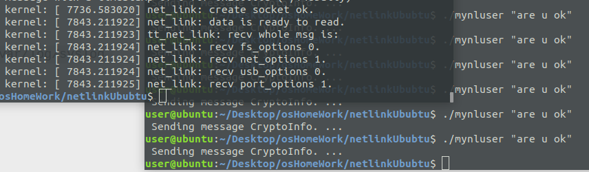

# 2018-08-13

[TOC]

## todo

- [ ] understand modules
- [ ] 

## refs:

用户空间和内核空间通讯之【Netlink 中】:

http://blog.chinaunix.net/uid-23069658-id-3405954.html

## modules 

在开始之前，还是先了解一下Linux内核模块机制吧！

　　模块（Module）机制：用户可以根据需要，在不需要对内核重新编译的情况下，可以将模块动态地载入或移出内核．

　　模块是具有独立功能的程序，它可以被单独编译，但不能独立运行，它在运行时被链接到内核，作为内核的一部分在内核空间运行．

　　模块通常由一组函数和数据结构组成，用来实现一种文件系统，一个驱动程序或其他内核上层的功能．

　　内核模块是Linux 内核向外提供的一个插口，其全称为动态可加载内核模块（Loader Kernel Module , LKM），简称为模块．

 

模块编程

　　内核模式下编程有一些限制：

　　I. 不能使用用户模式下的C标准库，因为内核模式下不存在lib库，也就没有这些用户函数供使用．

　　II. 不能使用浮点运算，因为Linux内核切换模式时不保存处理器的浮点状态．

　　III. 尽可能保持代码的清洁整齐，因为内核调试不方便，简洁的代码能减少并方便后期调试．

　　IV. 模块编程和内核版本密切关联，因为不同的内核版本中某些函数的函数名会有变化．因此模块编程也可以说是内核编程．

　　V. 只用超级用户可以对其运行

### add the module to linux kernal

`sudo insmode mynlkern.ko`

### 查看加载模块信息 only show module list

`lsmod`查看模块查看加载模块输出信息

will not show module's output, so we need follow ways: 如果日志在更新，如何实时查看

### 如果日志在更新，如何实时查看

用命令`dmesg  | tail -1`

`tail -f`

如果日志在更新，如何实时查看 `tail -f /var/log/messages`

还可以使用`watch -d -n 1 cat /var/log/messages`

`-d`表示高亮不同的地方，`-n`表示多少秒刷新一次。

#### ref(Ubuntu查看和写入系统日志 )

https://www.cnblogs.com/EasonJim/p/7189491.html

u can use :

`tail -n 10 /var/log/syslog`

### show u the result

## gnome-screenshot command

`cd T48DailyReport/img`

` gnome-screenshot -a -f net_link0.png`

