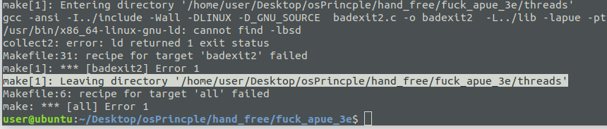
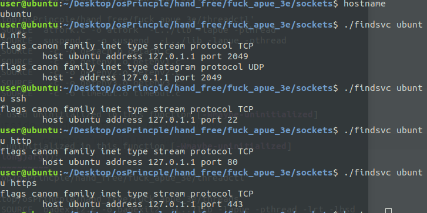
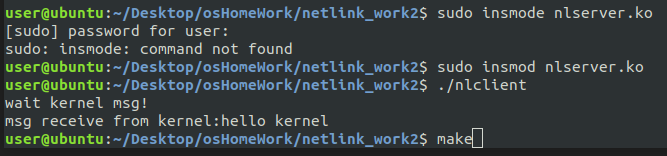

# 2018-08-14

[TOC]

today I read most APUR3rd C 16 about socket in user space, aka `ruptime.c` but little about netlink(at the end of today)

conclusion of `ruptime.c` :

所以整个程序的执行过程是：将服务器进程初始化为一个守护进程，程序名为ruptimed，这个程序提供ruptime服务（即调用uptime函数），调用getaddrinfo时，进程去主机host查找“ruptime”在/etc/services对应的端口号，经过hint过滤addrinfo的链表中，选取一个地址，将其和一个套接字绑定，然后监听，以便服务器和客户端建立链接。客户端调用getaddrinfo函数查找服务器上的ruptime服务，建立链接。

## todo

- [x] (not urge)read makefile doc and solve pics problem in T48/img
- [x] netlink by https://blog.csdn.net/u012819339/article/details/51334600
- [ ] goto detail of above netlink code

## looking for `connect_retry()`

when socket/ruptime.c compiling , no extern declaration of  `connect_retry()` found ,so when u want socket/ruptime.c to compile well, u need other folder's support, u can see in socket/makefile as follow, we got `LIBAPUE`, which is come from `Make.libapue.inc`

```
# Make.libapue.inc
$(LIBAPUE):
    (cd $(ROOT)/lib && $(MAKE))
## so this told us: go to /lib and see libapue.a
```


```
# socket/makefile
ROOT=..
PLATFORM=$(shell $(ROOT)/systype.sh)
include $(ROOT)/Make.defines.$(PLATFORM)

ifeq "$(PLATFORM)" "solaris"
  EXTRALIBS = -lsocket -lnsl
endif

PROGS = ruptime ruptimed ruptimed-fd ruptimed-dg
MOREPROGS = findsvc ruptime-dg

all:    $(PROGS) $(MOREPROGS) clconn.o clconn2.o initsrv1.o initsrv2.o 

%:  %.c $(LIBAPUE)

ruptime:    ruptime.o clconn2.o $(LIBAPUE)
        $(CC) $(CFLAGS) -o ruptime ruptime.o clconn2.o $(LDFLAGS) $(LDLIBS)

ruptimed:   ruptimed.o initsrv2.o $(LIBAPUE)
        $(CC) $(CFLAGS) -o ruptimed ruptimed.o initsrv2.o $(LDFLAGS) $(LDLIBS)

ruptimed-fd:    ruptimed-fd.o initsrv2.o $(LIBAPUE)
        $(CC) $(CFLAGS) -o ruptimed-fd ruptimed-fd.o initsrv2.o $(LDFLAGS) $(LDLIBS)

ruptimed-dg:    ruptimed-dg.o initsrv2.o $(LIBAPUE)
        $(CC) $(CFLAGS) -o ruptimed-dg ruptimed-dg.o initsrv2.o $(LDFLAGS) $(LDLIBS)

clean:
    rm -f $(PROGS) $(MOREPROGS) $(TEMPFILES) *.o

include $(ROOT)/Make.libapue.inc

```


anyway, the solution is use make at most outside folder, it will recursively make all subfolder. but one error occur:(when it comes: `make[1]: Leaving directory '/home/user/Desktop/osPrincple/hand_free/fuck_apue_3e/threads'`)




anyway, executable in /socket is OK. `findsrv.c` have following output:




### ruptime

u may have error like `Servname not supported for ai_socktype`
, and solution is:

```

服务器端的程序名为ruptimed，服务名为ruptime，为客户端提供uptime服务，由于ruptime服务是用户自定义的服务，在调用getaddrinfo时出现如下错误：

1 `Servname not supported for ai_socktype`

我给getaddrinfo函数提供了主机名和服务名，但需要在系统中登记，即将ruptime和端口号写入/etc/services中（注意用户自定义的端口号不能小于1024，以免和系统已经存在的端口号冲突。程序名和服务名不必相同，服务名更像是程序的别名），将

ruptime 4000/tcp

添加到/etc/services文件末尾，这样就不会出现上面的错误。

```


## python-sphinx

to read source code in browser, 

u need

```
    sudo apt-get install graphviz dvipng librsvg2-bin virtualenv texlive-xetex virtualenv sphinx_1.4
    . sphinx_1.4/bin/activate
    pip install -r Documentation/sphinx/requirements.txt
```


`apt-get install python-sphinx`

*don't know how to use sphinx, so,,,,useless don't do it again!!!*


## nlclient

code from https://blog.csdn.net/u012819339/article/details/51334600



## goto detail of above netlink code

got it; I copy the code and solve mang typo error and have the same output as his code; here is my code(from folder `netlint_work2ok_so_rewrite_by_hand`):

### nluser.c

```
/*copied code from http://blog.csdn.net/u012819339*/
#include <stdio.h>
#include <stdlib.h>
#include <sys/socket.h>
#include <string.h>
#include <linux/netlink.h>
#include <stdint.h>
#include <unistd.h>
#include <errno.h>

#define NETLINK_USER 22
#define USER_MSG (NETLINK_USER + 1)
#define MSG_LEN 100
#define MAX_PLOAD 100

struct _my_msg
{
    struct nlmsghdr hdr;
    int8_t data[MSG_LEN];
};

int
main(int argc, char ** argv)
{
    char * data = "user send hahah";
    struct sockaddr_nl local, dest_addr;
    int skfd;
    struct nlmsghdr * nlh = NULL;
    struct _my_msg info;
    int ret;

    skfd = socket(AF_NETLINK, SOCK_RAW, USER_MSG);
    if(skfd == -1)
    {
        printf("create socket error: %s\n", strerror(errno));
        return -1;
    }

    memset(&local, 0, sizeof(local));
    local.nl_family = AF_NETLINK;
    local.nl_pid = 50;
    local.nl_groups = 0;
    if(bind(skfd, (struct sockaddr *) &local, sizeof(local)) != 0)
    {
        printf("bind error\n");
        close(skfd);
        return -1;
    }
    memset(&dest_addr, 0, sizeof(dest_addr));
    dest_addr.nl_family = AF_NETLINK;
    dest_addr.nl_pid = 0;
    dest_addr.nl_groups = 0;

    nlh = (struct nlmsghdr *) malloc(NLMSG_SPACE(MAX_PLOAD));
    memset(nlh, 0, sizeof(struct nlmsghdr));
    nlh->nlmsg_len = NLMSG_SPACE(MAX_PLOAD);
    nlh->nlmsg_flags = 0;
    nlh->nlmsg_type = 0;
    nlh->nlmsg_seq = 0;
    nlh->nlmsg_pid = local.nl_pid;//kernel will unicast to port 50

    memcpy(NLMSG_DATA(nlh), data, strlen(data));

    ret = sendto(skfd, nlh, nlh->nlmsg_len, 0, (struct sockaddr *) & dest_addr, sizeof(struct sockaddr_nl));

    if(!ret)
    {
        perror("sendto error\n");
        close(skfd);
        exit(-1);
    }
    printf("wait for kernel msg\n");

    memset(&info, 0, sizeof(info));
    ret = recvfrom(skfd, &info, sizeof(struct _my_msg), 0, (struct sockaddr *) &dest_addr, sizeof(dest_addr));
    if(!ret)
    {
        perror("recv from kernel error\n");
        close(skfd);
        exit(-1);
    }
    printf("msg receive from kernel: %s\n", info.data);
    close(skfd);

    free((void *) nlh);
    return 0;
}
```


### nlkern.c

```
/*copied code from http://blog.csdn.net/u012819339*/

#include <linux/init.h>
#include <linux/kernel.h>
#include <linux/module.h>
#include <linux/types.h>
#include <linux/sched.h>
#include <net/sock.h>
#include <linux/netlink.h>


#define NETLINK_USER 22
#define USER_MSG (NETLINK_USER + 1)
#define USER_PORT 50

MODULE_LICENSE("GPL");
MODULE_AUTHOR("ZRT");
MODULE_DESCRIPTION("NETLINK_DEMO");

static struct sock * netlinkfd = NULL;

int send_msg(int8_t * pbuf, uint16_t len)
{
    struct sk_buff * nl_skb;
    struct nlmsghdr * nlh;

    int ret;

    nl_skb = nlmsg_new(len, GFP_ATOMIC);
    if(!nl_skb)
    {
        printk("netlink_alloc_skb error\n");
        return -1;
    }

    nlh = nlmsg_put(nl_skb, 0, 0, USER_MSG, len, 0);
    if(nlh == NULL)
    {
        printk("nlmsg_put error\n");
        nlmsg_free(nl_skb);
        return -1;
    }
    memcpy(nlmsg_data(nlh),pbuf, len);
    ret = netlink_unicast(netlinkfd, nl_skb, USER_PORT, MSG_DONTWAIT);
    return ret;
}

static void recv_cb(struct sk_buff *skb)
{
    struct nlmsghdr *nlh = NULL;
    void * data = NULL;

    printk("skb->len:%u\n", skb->len);
    if(skb->len >= nlmsg_total_size(0))
    {
        nlh = nlmsg_hdr(skb);
        data = NLMSG_DATA(nlh);
        if(data)
        {
            printk("kernel receive data: %s\n", (int8_t *) data);
            send_msg(data, nlmsg_len(nlh));
        }
    }
}

struct netlink_kernel_cfg cfg =
{
    .input = recv_cb,
};

static int __init test_netlink_init(void)
{
    printk("init netlink demo!\n");

    netlinkfd = netlink_kernel_create(&init_net, USER_MSG, &cfg);
    if(!netlinkfd)
    {
        printk(KERN_ERR "cannot create a netlink socket!\n");
        return -1;
    }

    printk("netlink demo init ok\n");
    return 0;
}

static void __exit test_netlink_exit(void)
{
    sock_release(netlinkfd->sk_socket);
    printk(KERN_DEBUG "netlink exit!\n");
}


module_init(test_netlink_init);
module_exit(test_netlink_exit);

```

### Makefile


```
obj-m := nlkern.o
KDIR := /lib/modules/$(shell uname -r)/build
PWD := $(shell pwd)

all:
    $(MAKE) -C $(KDIR) SUBDIRS=$(PWD) modules
    gcc nluser.c -o nluser
clean:
    rm -rf *.ko *.o *.order *.symvers *.unsigned *.mod.c nluser
```


