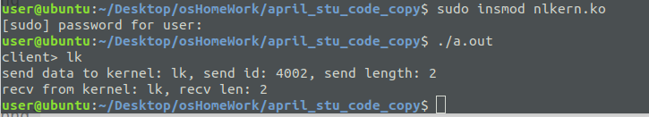

# 2018-08-15

[TOC]

## create a thread and stop it


```
struct task_struct *mytask;
/*代码中要有kthread_should_stop()判断 至于返回值只对kthread_stop才有意义*/
int func(void* data)
{
  while(1 )
  {
    if( kthread_should_stop())  return -1;
    printk(KERN_ALERT "func running\n");
    set_current_state(TASK_UNINTERRUPTIBLE);
      schedule_timeout(1*HZ);
  } 
  return 0;
}
 
线程创建和驱动
mytask=kthread_create(func,0,"mykthread");
wake_up_process(mytask);
 
在需要结束的地方调用
 kthread_stop(mytask);

```

## kthread_should_stop()'s return is 0 when things ok


```

/*multithread_test.c
*/
#include <linux/kernel.h>

#include <linux/module.h>

#include <linux/init.h>

#include <linux/param.h>

#include <linux/jiffies.h>

#include <asm/system.h>

#include <asm/processor.h>

#include <asm/signal.h>

#include <linux/completion.h>       // for DECLARE_COMPLETION()

#include <linux/sched.h>

#include <linux/delay.h>            // mdelay()

#include <linux/kthread.h>


MODULE_LICENSE("GPL");


static DECLARE_COMPLETION(my_completion);


static struct task_struct *task;


int flag = 0;


int my_fuction(void *arg)
{

    printk(" in %s()\n", __FUNCTION__);

    allow_signal(SIGKILL); //使得线程可以接收SIGKILL信号

    mdelay(2000);

    printk(" my_function complete()\n");

    printk("should stop: %d\n",kthread_should_stop());

    while (!signal_pending(current) && !kthread_should_stop()) {//使得线程可以可以被杀死，也可以再rmmod的时候结束

        printk(" jiffies is %lu\n", jiffies);

        set_current_state(TASK_INTERRUPTIBLE);

        schedule_timeout(HZ * 5);

         printk("should stop: %d\n",kthread_should_stop());

    }

    printk("Leaving my_function\n");/*called when killed */

    flag = 1; //flag很关键！

    return 0;

}


static int __init init(void)
{

    task = kthread_run(my_fuction,NULL,"my_function");

    printk("<1> init wait_for_completion()\n");

    return 0;

}


static void __exit finish(void)
{


        if(!flag)
        {

                 if (!IS_ERR(task))
                 {

                      int ret = kthread_stop(task);

                      printk(KERN_INFO "First thread function has stopped ,return %d\n", ret);

                 }

       }


    printk("task_struct: 0x%x",task);

    printk(" Goodbye\n");

}


module_init(init);

module_exit(finish);

```


问题是编译mod时存在一些`include <asm/system.h>`的错误。


## copy code from old student

source:https://blog.csdn.net/faming7407/article/details/79873086

### make a kernel mod of above code 

#### errors1:

```
/home/user/Desktop/osHomeWork/april_stu_code_copy/nlkern.c:186:18: error: ‘struct netlink_skb_parms’ has no member named ‘pid’; did you mean ‘nsid’?
  NETLINK_CB(skb).pid = 0;

```

so I find :

```
#define NETLINK_CB(skb)     (*(struct netlink_skb_parms*)&((skb)->cb))
```

though wired(`cb` is actually just a `char cb[48]`), but at last, `cb` goes to `netlink_skb_parms`, as follow:

```
//tt: I hope this struct is 48B
struct netlink_skb_parms {
    struct scm_creds    creds;      /* Skb credentials  */
    __u32           portid;
    __u32           dst_group;
    __u32           flags;
    struct sock     *sk;
    bool            nsid_is_set;
    int         nsid;
};
```

for u reference `cb` in `skb(aka, sk_buff)` is a `char cb[48]`, see following

##### struct sk_buff

definenation:

/include/linux/skbuff.h   line 658

```
/** 
 *  struct sk_buff - socket buffer
 *  @next: Next buffer in list
 *  @prev: Previous buffer in list
 *  @tstamp: Time we arrived/left
 *  @rbnode: RB tree node, alternative to next/prev for netem/tcp
 *  @sk: Socket we are owned by
 *  @dev: Device we arrived on/are leaving by
 *  @cb: Control buffer. Free for use by every layer. Put private vars here
 *  @_skb_refdst: destination entry (with norefcount bit)
 *  @sp: the security path, used for xfrm
 *  @len: Length of actual data
 *  @data_len: Data length
 *  @mac_len: Length of link layer header
 *  @hdr_len: writable header length of cloned skb
 *  @csum: Checksum (must include start/offset pair)
 *  @csum_start: Offset from skb->head where checksumming should start
 *  @csum_offset: Offset from csum_start where checksum should be stored
 *  @priority: Packet queueing priority
 *  @ignore_df: allow local fragmentation
 *  @cloned: Head may be cloned (check refcnt to be sure)
 *  @ip_summed: Driver fed us an IP checksum
 *  @nohdr: Payload reference only, must not modify header
 *  @pkt_type: Packet class
 *  @fclone: skbuff clone status
 *  @ipvs_property: skbuff is owned by ipvs
 *  @tc_skip_classify: do not classify packet. set by IFB device
 *  @tc_at_ingress: used within tc_classify to distinguish in/egress
 *  @tc_redirected: packet was redirected by a tc action
 *  @tc_from_ingress: if tc_redirected, tc_at_ingress at time of redirect
 *  @peeked: this packet has been seen already, so stats have been
 *      done for it, don't do them again
 *  @nf_trace: netfilter packet trace flag
 *  @protocol: Packet protocol from driver
 *  @destructor: Destruct function
 *  @tcp_tsorted_anchor: list structure for TCP (tp->tsorted_sent_queue)
 *  @_nfct: Associated connection, if any (with nfctinfo bits)
 *  @nf_bridge: Saved data about a bridged frame - see br_netfilter.c
 *  @skb_iif: ifindex of device we arrived on
 *  @tc_index: Traffic control index
 *  @hash: the packet hash
 *  @queue_mapping: Queue mapping for multiqueue devices
 *  @xmit_more: More SKBs are pending for this queue
 *  @ndisc_nodetype: router type (from link layer)
 *  @ooo_okay: allow the mapping of a socket to a queue to be changed
 *  @l4_hash: indicate hash is a canonical 4-tuple hash over transport
 *      ports.
 *  @sw_hash: indicates hash was computed in software stack
 *  @wifi_acked_valid: wifi_acked was set
 *  @wifi_acked: whether frame was acked on wifi or not
 *  @no_fcs:  Request NIC to treat last 4 bytes as Ethernet FCS
 *  @csum_not_inet: use CRC32c to resolve CHECKSUM_PARTIAL
 *  @dst_pending_confirm: need to confirm neighbour
  * @napi_id: id of the NAPI struct this skb came from
 *  @secmark: security marking
 *  @mark: Generic packet mark
 *  @vlan_proto: vlan encapsulation protocol
 *  @vlan_tci: vlan tag control information
 *  @inner_protocol: Protocol (encapsulation)
 *  @inner_transport_header: Inner transport layer header (encapsulation)
 *  @inner_network_header: Network layer header (encapsulation)
 *  @inner_mac_header: Link layer header (encapsulation)
 *  @transport_header: Transport layer header
 *  @network_header: Network layer header
 *  @mac_header: Link layer header
 *  @tail: Tail pointer
 *  @end: End pointer
 *  @head: Head of buffer
 *  @data: Data head pointer
 *  @truesize: Buffer size
 *  @users: User count - see {datagram,tcp}.c
 */

struct sk_buff {
    union {
        struct {
            /* These two members must be first. */
            struct sk_buff      *next;
            struct sk_buff      *prev;

            union {
                struct net_device   *dev;
                /* Some protocols might use this space to store information,
                 * while device pointer would be NULL.
                 * UDP receive path is one user.
                 */
                unsigned long       dev_scratch;
            };
        };
        struct rb_node  rbnode; /* used in netem & tcp stack */
    };
    struct sock     *sk;

    union {
        ktime_t     tstamp;
        u64     skb_mstamp;
    };
    /*
     * This is the control buffer. It is free to use for every
     * layer. Please put your private variables there. If you
     * want to keep them across layers you have to do a skb_clone()
     * first. This is owned by whoever has the skb queued ATM.
     */
    char            cb[48] __aligned(8);

    union {
        struct {
            unsigned long   _skb_refdst;
            void        (*destructor)(struct sk_buff *skb);
        };
        struct list_head    tcp_tsorted_anchor;
    };

#ifdef CONFIG_XFRM
    struct  sec_path    *sp;
#endif
#if defined(CONFIG_NF_CONNTRACK) || defined(CONFIG_NF_CONNTRACK_MODULE)
    unsigned long        _nfct;
#endif
#if IS_ENABLED(CONFIG_BRIDGE_NETFILTER)
    struct nf_bridge_info   *nf_bridge;
#endif
    unsigned int        len,
                data_len;
    __u16           mac_len,
                hdr_len;

    /* Following fields are _not_ copied in __copy_skb_header()
     * Note that queue_mapping is here mostly to fill a hole.
     */
    __u16           queue_mapping;

/* if you move cloned around you also must adapt those constants */
#ifdef __BIG_ENDIAN_BITFIELD
#define CLONED_MASK (1 << 7)
#else
#define CLONED_MASK 1
#endif
#define CLONED_OFFSET()     offsetof(struct sk_buff, __cloned_offset)

    __u8            __cloned_offset[0];
    __u8            cloned:1,
                nohdr:1,
                fclone:2,
                peeked:1,
                head_frag:1,
                xmit_more:1,
                __unused:1; /* one bit hole */

    /* fields enclosed in headers_start/headers_end are copied
     * using a single memcpy() in __copy_skb_header()
     */
    /* private: */
    __u32           headers_start[0];
    /* public: */

/* if you move pkt_type around you also must adapt those constants */
#ifdef __BIG_ENDIAN_BITFIELD
#define PKT_TYPE_MAX    (7 << 5)
#else
#define PKT_TYPE_MAX    7
#endif
#define PKT_TYPE_OFFSET()   offsetof(struct sk_buff, __pkt_type_offset)

    __u8            __pkt_type_offset[0];
    __u8            pkt_type:3;
    __u8            pfmemalloc:1;
    __u8            ignore_df:1;

    __u8            nf_trace:1;
    __u8            ip_summed:2;
    __u8            ooo_okay:1;
    __u8            l4_hash:1;
    __u8            sw_hash:1;
    __u8            wifi_acked_valid:1;
    __u8            wifi_acked:1;

    __u8            no_fcs:1;
    /* Indicates the inner headers are valid in the skbuff. */
    __u8            encapsulation:1;
    __u8            encap_hdr_csum:1;
    __u8            csum_valid:1;
    __u8            csum_complete_sw:1;
    __u8            csum_level:2;
    __u8            csum_not_inet:1;

    __u8            dst_pending_confirm:1;
#ifdef CONFIG_IPV6_NDISC_NODETYPE
    __u8            ndisc_nodetype:2;
#endif
    __u8            ipvs_property:1;
    __u8            inner_protocol_type:1;
    __u8            remcsum_offload:1;
#ifdef CONFIG_NET_SWITCHDEV
    __u8            offload_fwd_mark:1;
    __u8            offload_mr_fwd_mark:1;
#endif
#ifdef CONFIG_NET_CLS_ACT
    __u8            tc_skip_classify:1;
    __u8            tc_at_ingress:1;
    __u8            tc_redirected:1;
    __u8            tc_from_ingress:1;
#endif

#ifdef CONFIG_NET_SCHED
    __u16           tc_index;   /* traffic control index */
#endif

    union {
        __wsum      csum;
        struct {
            __u16   csum_start;
            __u16   csum_offset;
        };
    };
    __u32           priority;
    int         skb_iif;
    __u32           hash;
    __be16          vlan_proto;
    __u16           vlan_tci;
#if defined(CONFIG_NET_RX_BUSY_POLL) || defined(CONFIG_XPS)
    union {
        unsigned int    napi_id;
        unsigned int    sender_cpu;
    };
#endif
#ifdef CONFIG_NETWORK_SECMARK
    __u32       secmark;
#endif

    union {
        __u32       mark;
        __u32       reserved_tailroom;
    };

    union {
        __be16      inner_protocol;
        __u8        inner_ipproto;
    };

    __u16           inner_transport_header;
    __u16           inner_network_header;
    __u16           inner_mac_header;

    __be16          protocol;
    __u16           transport_header;
    __u16           network_header;
    __u16           mac_header;

    /* private: */
    __u32           headers_end[0];
    /* public: */

    /* These elements must be at the end, see alloc_skb() for details.  */
    sk_buff_data_t      tail;
    sk_buff_data_t      end;
    unsigned char       *head,
                *data;
    unsigned int        truesize;
    refcount_t      users;
};
```

then I go to find ` @cb: Control buffer. Free for use by every layer. Put private vars here`


#### error2:

```
/home/user/Desktop/osHomeWork/april_stu_code_copy/nlkern.c:182:11: warning: assignment makes pointer from integer without a cast [-Wint-conversion]
  old_tail = skb->tail;
           ^
/home/user/Desktop/osHomeWork/april_stu_code_copy/nlkern.c:185:33: error: invalid operands to binary - (have ‘sk_buff_data_t {aka unsigned int}’ and ‘unsigned char *’)
  nlh -> nlmsg_len = (skb->tail) - old_tail;

```

mean: 不同的类型有运算，我觉得需要改动二者中一个的类型。

for u ref:(/include/linux/skbuff.h line 582)


```
#ifdef NET_SKBUFF_DATA_USES_OFFSET
typedef unsigned int sk_buff_data_t;
#else
typedef unsigned char *sk_buff_data_t;
#endif
```


#### finally compile success

though there are warnings

```

user@ubuntu:~/Desktop/osHomeWork/april_stu_code_copy$ make
make -C /lib/modules/4.15.0-30-generic/build SUBDIRS=/home/user/Desktop/osHomeWork/april_stu_code_copy modules
make[1]: Entering directory '/usr/src/linux-headers-4.15.0-30-generic'
Makefile:976: "Cannot use CONFIG_STACK_VALIDATION=y, please install libelf-dev, libelf-devel or elfutils-libelf-devel"
  CC [M]  /home/user/Desktop/osHomeWork/april_stu_code_copy/nlkern.o
In file included from ./include/linux/printk.h:7:0,
                 from ./include/linux/kernel.h:14,
                 from /home/user/Desktop/osHomeWork/april_stu_code_copy/nlkern.c:1:
/home/user/Desktop/osHomeWork/april_stu_code_copy/nlkern.c: In function ‘kernel_recv_thread’:
./include/linux/kern_levels.h:5:18: warning: format ‘%d’ expects argument of type ‘int’, but argument 4 has type ‘size_t {aka long unsigned int}’ [-Wformat=]
 #define KERN_SOH "\001"  /* ASCII Start Of Header */
                  ^
./include/linux/kern_levels.h:15:20: note: in expansion of macro ‘KERN_SOH’
 #define KERN_DEBUG KERN_SOH "7" /* debug-level messages */
                    ^~~~~~~~
/home/user/Desktop/osHomeWork/april_stu_code_copy/nlkern.c:282:11: note: in expansion of macro ‘KERN_DEBUG’
    printk(KERN_DEBUG "[kernel space] recv from user: %s, recv_pid: %d, recv_len: %d\n",\
           ^~~~~~~~~~
/home/user/Desktop/osHomeWork/april_stu_code_copy/nlkern.c:282:83: note: format string is defined here
 (KERN_DEBUG "[kernel space] recv from user: %s, recv_pid: %d, recv_len: %d\n",\
                                                                         ~^
                                                                                  %ld
  Building modules, stage 2.
  MODPOST 1 modules
  CC      /home/user/Desktop/osHomeWork/april_stu_code_copy/nlkern.mod.o
  LD [M]  /home/user/Desktop/osHomeWork/april_stu_code_copy/nlkern.ko
make[1]: Leaving directory '/usr/src/linux-headers-4.15.0-30-generic'
user@ubuntu:~/Desktop/osHomeWork/april_stu_code_copy$ 

```

##### my version 1 success code 

nlkern.c

```
#include <linux/kernel.h>
#include <linux/module.h>
#include <linux/types.h>
#include <linux/sched.h>
#include <net/sock.h>
#include <linux/netlink.h>
#include <linux/kthread.h>
#include <linux/err.h>
#include <linux/fs.h>
#include <linux/init.h>
#include <linux/cdev.h>

#define MEMDEV_MAJOR    255
#define MEMDEV_NR_DEVS  1
#define MEMDEV_SIZE     1024/*1KB data we can store in struct echo_dev*/
#define NETLINK_TEST    17
#define UP_TO_LOW       0
#define LOW_TO_UP       1
#define MAX_PID_COUNT   100
#define MSG_LEN         125

#ifndef SLEEP_MILLI_SEC
#define SLEEP_MILLI_SEC(mMillisec) \
    do{\
        long timeout = (mMillisec) * HZ / 1000;\
        while(timeout > 0)\
        {\
            timeout = schedule_timeout(timeout);\
        }\
    }while(0);
#endif
/*funcs declaration*/
static int echo_open(struct inode *inode, struct file *filp);
static ssize_t echo_read(struct file *filp, char __user *buf, size_t size, loff_t *ppos);
static long echo_ioctl(struct file *filp, unsigned int cmd, unsigned long arg);
void kernel_recv_thread(struct sk_buff * __skb);

/*variable declaration*/
static int echo_major = MEMDEV_MAJOR;
module_param(echo_major, int, S_IRUGO);
struct echo_dev * echo_devp;
struct cdev cdev;
char * echo_dev = "echo dev";
static struct sock * netlinkfd = NULL;
static struct task_struct * task_test[MAX_PID_COUNT];
static int pid_index = 0;
static int char_num = 0;/*record how many char processed*/
static int char_cnvt_flag = 0;

struct echo_dev
{
    char * data;
    unsigned long size;
};
struct
{
    __u32 pid;
}user_process;

struct echo_netlink
{
    __u32 pid;
    char buf[MSG_LEN];
    int length;
};

struct echo_netlink client_netlink[MAX_PID_COUNT];

static const struct file_operations echo_fops =
{
    .owner = THIS_MODULE,
    .open = echo_open,
    .read = echo_read,
    .unlocked_ioctl = echo_ioctl,
};

struct netlink_kernel_cfg cfg =
{
    .input = kernel_recv_thread,
};


/*function prototype*/
static int echo_open(struct inode * inode, struct file * filp)
{
    printk(KERN_DEBUG"[kernel space] open char device!!\n");
    return 0;
}
static ssize_t echo_read(struct file * filp, char __user * buf, size_t size, loff_t * ppos)
{
    printk(KERN_DEBUG"[kernel space] test netlink exit!! \n");
    return char_num;
}
static long echo_ioctl(struct file * filp, unsigned int cmd, unsigned long arg)
{
    int result;

    switch(cmd)
    {
        case UP_TO_LOW:
            char_cnvt_flag = 0;
            break;
        case LOW_TO_UP:
            char_cnvt_flag = 1;
            break;
        default:
            result = -1;
            break;
    }
    printk(KERN_DEBUG"[kernel space] ioctl cmd: %d\n", char_cnvt_flag);
    return result;
}

int init_char_device(void)
{
    int i, result;
    dev_t devno = MKDEV(echo_major, 0);
    if(echo_major)
    {
        /* 静态申请设备号*/
        result = register_chrdev_region(devno, 2, "echodev");
    }
    else
    {
        /* 动态分配设备号 */
        result = alloc_chrdev_region(&devno, 0, 2, "echodev");
        echo_major = MAJOR(devno);
    }
    if(result < 0)
    {
        return result;/*return for  error occured when alloc new dev*/
    }
    /*no error, we got devno, and config cdev by echo_fops*/
    cdev_init(&cdev, &echo_fops);
    cdev.owner = THIS_MODULE;
    cdev.ops = &echo_fops;
    /* 注册字符设备 */
    cdev_add(&cdev, MKDEV(echo_major, 0), MEMDEV_NR_DEVS);
    /* 为设备描述结构分配内存 *//* 为设备描述结构分配内存 */
    echo_devp = kmalloc(MEMDEV_NR_DEVS * sizeof(struct echo_dev), GFP_KERNEL);

    if(!echo_devp)
    {
        result = -1;
        goto fail_malloc;
    }
    memset(echo_devp, 0, sizeof(struct echo_dev));
    for(i = 0; i < MEMDEV_NR_DEVS; i ++)
    {
        echo_devp[i].size = MEMDEV_SIZE;
        echo_devp[i].data = kmalloc(MEMDEV_SIZE, GFP_KERNEL);
        memset(echo_devp[i].data, 0, MEMDEV_SIZE);
    }
    printk(KERN_ERR"[kernel space] create char device success!\n");
    return 0;/*return point: p1*/

    fail_malloc:
        unregister_chrdev_region(devno, 1);

    return result;/*how can we execute to here? we already returned at return point: p1;; move this to goto clause fail_malloc scope*/
}
void delete_device(void)
{
    cdev_del(&cdev);

    unregister_chrdev_region(MKDEV(echo_major, 0), 2);
    printk(KERN_DEBUG"[kernel space] echo_dev_del!!\n");
}
static int kernel_send_thread(void * index)
{
    int threadindex = *((int *) index);
    int size;
    struct sk_buff *skb;
    unsigned int old_tail;
    struct nlmsghdr *nlh;
    int retval;
    int i = 0;

    size = NLMSG_SPACE(client_netlink[threadindex].length);
    skb = alloc_skb(size, GFP_ATOMIC);
    nlh = nlmsg_put(skb, 0, 0, 0, NLMSG_SPACE(client_netlink[threadindex].length) - sizeof(struct nlmsghdr), 0);
    old_tail = skb->tail;

    strcpy(NLMSG_DATA(nlh), client_netlink[threadindex].buf);
    nlh -> nlmsg_len = (skb->tail) - old_tail;
    /*in include/linux/netlink.h
    #define NETLINK_CB(skb)     (*(struct netlink_skb_parms*)&((skb)->cb))*/
    NETLINK_CB(skb).portid = 0;
    NETLINK_CB(skb).dst_group = 0;

    printk(KERN_DEBUG "[kernel space] send to user: %s, send_pid: %d, send_len: %d\n",\
        (char *) NLMSG_DATA((struct nlmsghdr *) skb -> data), client_netlink[threadindex].pid,\
        client_netlink[threadindex].length);

    retval = netlink_unicast(netlinkfd, skb, client_netlink[threadindex].pid, MSG_DONTWAIT);
    if(retval)
    {
        printk(KERN_DEBUG "[kernel space] client closed: \n");
    }
    while(!(i = kthread_should_stop()))
    {
        printk(KERN_DEBUG "[kernel space] kthread should stop: %d\n",i);
        SLEEP_MILLI_SEC(1000*10);
    }
    return 0;
}
void char_convert(int id)
{
    int len = client_netlink[id].length;
    int i = 0;
    client_netlink[id].buf[len] = '\0';
    if(UP_TO_LOW == char_cnvt_flag)
    {
        for(i = 0; client_netlink[id].buf[i] != '\0'; i++)
        {
            if(client_netlink[id].buf[i] > 'A' && client_netlink[id].buf[i] < 'Z')
            {
                client_netlink[id].buf[i] += 0x20;
                mdelay(200);
            }
        }
    }
    else if(LOW_TO_UP == char_cnvt_flag)
    {
        for (i = 0; client_netlink[id].buf[i] != '\0'; i++)
        {
            if (client_netlink[id].buf[i] > 'a' && client_netlink[id].buf[i] < 'z')
            {
                client_netlink[id].buf[i] -= 0x20;
                mdelay(200);
            }
        }
    }
    char_num += len;
}

void run_netlink_thread(int threadindex)
{
    int err;
    char process_name[64] = {0};
    void * data = kmalloc(sizeof(int), GFP_ATOMIC);
    *(int *) data = threadindex;
    snprintf(process_name, 63, "child_thread-%d", threadindex);
    task_test[threadindex] = kthread_create(kernel_send_thread, data, process_name);

    if(IS_ERR(task_test[threadindex]))
    {
        err = PTR_ERR(task_test[threadindex]);
        printk(KERN_DEBUG "[kernel space] create child thread failed \n");
    }
    else
    {
        printk(KERN_DEBUG "[kernel space] create child_thread-%d \n", threadindex);
        wake_up_process(task_test[threadindex]);
    }
}

void buf_deal(int id)
{
    char_convert(id);
    run_netlink_thread(id);
}

void kernel_recv_thread(struct sk_buff * __skb)
{
    struct sk_buff * skb;
    struct nlmsghdr * nlh = NULL;
    char * recv_data = NULL;
    int pid_id = 0;
    printk(KERN_DEBUG "[kernel space] began recv from user");
    skb = skb_get(__skb);

    if(skb->len >= NLMSG_SPACE(0))
    {
        nlh = nlmsg_hdr(skb);
        if(pid_index < MAX_PID_COUNT)
        {
            client_netlink[pid_index].pid = nlh->nlmsg_pid;
            recv_data = NLMSG_DATA(nlh);
            strcpy(client_netlink[pid_index].buf,recv_data);
            client_netlink[pid_index].length = strlen(recv_data);
            printk(KERN_DEBUG "[kernel space] recv from user: %s, recv_pid: %d, recv_len: %d\n",\
                (char *) NLMSG_DATA(nlh), client_netlink[pid_index].pid, strlen(recv_data));
            pid_id = pid_index;
            pid_index ++;
            buf_deal(pid_id);
        }
        else
        {
            printk(KERN_DEBUG "[kernel space] out of pid\n");
        }
        kfree_skb(skb);
    }
}
int init_netlink(void)
{
    netlinkfd = netlink_kernel_create(&init_net, NETLINK_TEST, &cfg);
    if(!netlinkfd)
    {
        return -1;
    }
    else
    {
        printk(KERN_ERR "[kernel space] create netlink success!\n");
        return 0;
    }
}

void netlink_release(void)
{
    printk(KERN_DEBUG "[kernel space] echo_netlink_exittt!!!");
    if(netlinkfd != NULL)
    {
        sock_release(netlinkfd -> sk_socket);
    }
}

void stop_kthread(void)
{
    int i;
    printk(KERN_ERR "[kernel sapce] stop kthread\n");
    for(i = 0; i != pid_index; i ++)
    {
        if(task_test[i] != NULL)
        {
            kthread_stop(task_test[i]);
            task_test[i] = NULL;
        }
    }
}

void init_client(void)
{
    int i = 0;
    for (i = 0; i < MAX_PID_COUNT; i ++)
    {
        client_netlink[i].pid = 0;
        task_test[i] = NULL;
    }
}

/*module related funcs for system to load/remove us*/
int __init init_echo_module(void)
{
    int result = 0;

    init_client();

    result = init_char_device();
    if( result < 0)
    {
        printk(KERN_ERR "[kernel space] cannot create a netlink socket for char device!\n");
        return result;
    }
    result = init_netlink();
    if(result < 0)
    {
        printk (KERN_ERR "[kernel space] cannot create a netlink socket for netlink init\n");
        return result;
    }
    return result;
}

void __exit exit_echo_module(void)
{
    netlink_release();
    stop_kthread();
    delete_device();
}
module_init(init_echo_module);
module_exit(exit_echo_module);
MODULE_LICENSE("GPL");
MODULE_AUTHOR("ZHENG from zhang");
MODULE_VERSION("V1.1");

```

### copy the user app of above code 

compile error:

```
user@ubuntu:~/Desktop/osHomeWork/april_stu_code_copy$ gcc nluser.c 
nluser.c: In function ‘sig_pipe’:
nluser.c:37:20: error: ‘SIGUSER1’ undeclared (first use in this function); did you mean ‘SIGUSR1’?
  kill(local.nl_pid,SIGUSER1);
                    ^~~~~~~~
                    SIGUSR1
nluser.c:37:20: note: each undeclared identifier is reported only once for each function it appears in
nluser.c: In function ‘init_netlink’:
nluser.c:89:62: warning: format ‘%d’ expects argument of type ‘int’, but argument 4 has type ‘size_t {aka long unsigned int}’ [-Wformat=]
  printf("send data to kernel: %s, send id: %d, send length: %d\n", \
                                                             ~^
                                                             %ld
   (char *) NLMSG_DATA(message), local.nl_pid, strlen(send_data) - 1);
                                               ~~~~~~~~~~~~~~~~~~~~~
nluser.c: In function ‘main’:
nluser.c:97:2: error: unknown type name ‘socket_t’; did you mean ‘socklen_t’?
  socket_t deslen = sizeof(struct sockaddr_nl);
  ^~~~~~~~
  socklen_t
nluser.c:128:90: error: ‘destlen’ undeclared (first use in this function); did you mean ‘deslen’?
 fd, &info, sizeof(struct u_packet_info),0,(struct sockaddr *) &dest, &destlen);
                                                                       ^~~~~~~
                                                                                          deslen
nluser.c:129:44: warning: format ‘%d’ expects argument of type ‘int’, but argument 3 has type ‘size_t {aka long unsigned int}’ [-Wformat=]
   printf("recv from kernel: %s, recv len: %d\n", (char *)info.msg, strlen(info.msg));
                                           ~^                       ~~~~~~~~~~~~~~~~
                                           %ld
nluser.c:139:22: error: ‘SIGUSER1’ undeclared (first use in this function); did you mean ‘SIGUSR1’?
   kill(local.nl_pid, SIGUSER1);
                      ^~~~~~~~
                      SIGUSR1

```

so again, a typo of `SIGUSR1` to `SIGUSER1`;

anyway when I fix typo, work well:



#### nluser.c content

```
/*copy 用户态netlink socket源码*/
#include <stdio.h>
#include <stdlib.h>
#include <sys/socket.h>
#include <sys/types.h>
#include <unistd.h>
#include <string.h>
#include <sys/time.h>
#include <linux/netlink.h>
#include <signal.h>

#define NETLINK_TEST    17
#define MSG_LEN         125
#define BUF_LEN         125
#define TIME            210

int skfd;
struct sockaddr_nl local;
struct sockaddr_nl dest;
struct nlmsghdr *message;

struct msg_to_kernel
{
    struct nlmsghdr hdr;
    char data[MSG_LEN];
};
struct u_packet_info
{
    struct nlmsghdr hdr;
    char msg[MSG_LEN];
};

static void sig_pipe(int sign)
{
    printf("catch a SIGPIPE signal\n");
    close(skfd);
    kill(local.nl_pid,SIGUSR1);
    exit(-1);
}
int init_netlink(void)
{
    char send_data[BUF_LEN];
    message = (struct nlmsghdr *) malloc(1);
    skfd = socket(PF_NETLINK, SOCK_RAW, NETLINK_TEST);
    if(skfd < 0)
    {
        printf("can not create a netlink socket\n");
        return -1;
    }
    /*set local addr and bind*/
    memset(&local, 0, sizeof(local));
    local.nl_family = AF_NETLINK;
    local.nl_pid = getpid();
    local.nl_groups = 0;
    if(bind(skfd, (struct sockaddr *) &local, sizeof(local)) != 0)
    {
        printf("bind() error\n");
        return -1;
    }
    /*set dest*/
    memset(&dest, 0, sizeof(dest));
    dest.nl_family = AF_NETLINK;
    dest.nl_pid = 0;
    dest.nl_groups = 0;
    /*set message*/
    memset(message, '\0', sizeof(struct nlmsghdr));
    message->nlmsg_len = NLMSG_SPACE(MSG_LEN);
    message->nlmsg_flags = 0;
    message->nlmsg_type = 0;
    message->nlmsg_seq = 0;
    message->nlmsg_pid = local.nl_pid;

    /*and then.....grab user input*/
    while(1)
    {
        printf("client> ");
        fgets(send_data, MSG_LEN, stdin);
        if( 0 == (strlen(send_data) - 1))
        {
            continue;
        }
        else
        {
            break;
        }
    }
    /*now we have user input in send_data, send it by memcpy*/
    memcpy(NLMSG_DATA(message), send_data, strlen(send_data) - 1);
    printf("send data to kernel: %s, send id: %d, send length: %d\n", \
        (char *) NLMSG_DATA(message), local.nl_pid, strlen(send_data) - 1);
    return 0;
}

int main(int argc, char* argv[])
{
    int ret, len;
    socklen_t destlen = sizeof(struct sockaddr_nl);
    struct u_packet_info info;
    fd_set fd_sets;
    struct timeval select_time;

    signal(SIGINT, sig_pipe);
    signal(SIGINT, sig_pipe);

    ret = init_netlink();
    if(ret < 0)
    {
        close(skfd);
        perror("netlink failed");
        exit(-1);
    }

    FD_ZERO(&fd_sets);
    FD_SET(skfd, &fd_sets);

    len = sendto(skfd, message, message->nlmsg_len, 0, (struct sockaddr *)&dest, sizeof(dest));
    if(!len)
    {
        perror("send pid:(error)");
        exit(1);
    }
    select_time.tv_sec = TIME;
    select_time.tv_usec = 0;
    ret = select(skfd + 1, &fd_sets, NULL, NULL, &select_time);

    if(ret > 0)
    {
        len = recvfrom(skfd, &info, sizeof(struct u_packet_info),0,(struct sockaddr *) &dest, &destlen);
        printf("recv from kernel: %s, recv len: %d\n", (char *)info.msg, strlen(info.msg));
    }
    else if(ret < 0)
    {
        perror("\nerror\n");
        exit(-1);
    }
    else
    {
        printf("\nkernel server disconnet!\n");
        kill(local.nl_pid, SIGUSR1);
    }
    close(skfd);
    return 0;
}

```